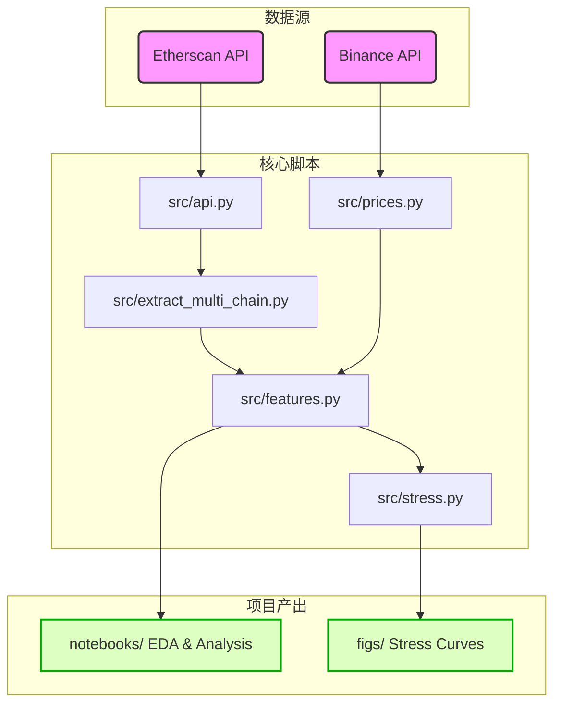

# DeFi Liquidation Risk Visualization

A data-driven analysis and visualization system for Aave V3 liquidation events across multiple blockchain networks, with a focus on Ethereum mainnet.

## Overview

DeFi lending protocols allow users to borrow assets against cryptocurrency collateral, but positions face liquidation when collateral values drop below protocol thresholds. This project provides:

- **Multi-chain data extraction** of Aave V3 `LiquidationCall` events via the Etherscan API
- **Price data integration** from Binance (daily ETH/USDT candles)
- **Risk metric computation** including daily liquidation counts, return-liquidation correlation, and asymmetry analysis
- **Kernel regression stress testing** estimating expected liquidation volumes under hypothetical price shocks
- **Publication-quality visualizations** (Matplotlib) and exploratory Jupyter notebooks

## Architecture



## Key Findings (7,832 liquidation events, Jan–Oct 2025)

- **2.4:1 asymmetry**: Down days average 45.8 liquidations vs. 18.8 on up days
- **Nonlinear stress response**: A 10% ETH decline triggers ~95 daily liquidations; 20% triggers ~185 (convex, not linear)
- **Temporal clustering**: Liquidation spikes align with periods of elevated ETH volatility
- **Critical threshold**: The -5% daily return mark is an inflection point for accelerating liquidation activity

## Project Structure

```
├── src/
│   ├── api.py                 # Etherscan API wrapper (log fetching, block queries)
│   ├── config.py              # Chain/asset configuration (addresses, start blocks)
│   ├── extract_multi_chain.py # Multi-chain liquidation event extraction
│   ├── features.py            # Feature engineering (daily aggregation, returns)
│   ├── prices.py              # Binance price data fetching
│   └── stress.py              # Nadaraya-Watson kernel regression stress model
├── notebooks/
│   ├── 01_quick_eda.ipynb     # Exploratory data analysis
│   └── 02_stress_test.ipynb   # Stress-test analysis
├── data/
│   ├── aave_liqs_ethscan.csv  # Raw liquidation events (7,832 events)
│   ├── eth_ret_vs_liq.csv     # Merged daily returns + liquidation counts
│   ├── stress_curve_1d.csv    # 1-day stress curve output
│   └── stress_curve_7d.csv    # 7-day stress curve output
├── figs/                      # Generated figures (PNG + PDF)
├── gen_paper_figs.py          # Script to generate all paper figures
├── .github/workflows/
│   └── update.yml             # Automated data refresh (GitHub Actions)
├── Makefile
└── requirements.txt
```

## Installation

```bash
git clone https://github.com/Feelinx-crypto/defi-liquidation-risk-visual.git
cd defi-liquidation-risk-visual
pip install -r requirements.txt
```

## Usage

### Refresh Data
```bash
make update         # Re-extract liquidation events and price data
```

### Generate Paper Figures
```bash
python gen_paper_figs.py   # Outputs PDF + PNG to figs/
```

### Run Notebooks
```bash
jupyter notebook notebooks/01_quick_eda.ipynb
jupyter notebook notebooks/02_stress_test.ipynb
```

## Methodology

1. **Data Extraction**: Queries Aave V3 `LiquidationCall` event logs from Ethereum via the Etherscan API (`src/api.py` + `src/extract_multi_chain.py`). Supports Ethereum, Polygon, Arbitrum, and Optimism.

2. **Feature Engineering**: Aggregates events into daily counts, fetches ETH/USDT closing prices from Binance, computes simple percentage returns, and merges into a unified dataset (`src/features.py` + `src/prices.py`).

3. **Stress Testing**: Uses a Nadaraya-Watson kernel regression estimator to model the conditional expectation of liquidation counts given hypothetical ETH price shocks, with confidence bands and effective sample counts (`src/stress.py`).

4. **Visualization**: Publication-quality Matplotlib figures for the research paper; Jupyter notebooks for interactive exploration.

## Data Sources

- **Etherscan API**: On-chain Aave V3 liquidation event logs
- **Binance API**: Daily ETH/USDT candlestick data

## Tech Stack

- Python 3.10+
- pandas / NumPy / SciPy (data processing & statistics)
- Matplotlib / Plotly (visualization)
- Jupyter (interactive analysis)
- GitHub Actions (automated data refresh)

## Academic Context

This project was developed as part of a Duke Kunshan University Signature Work project, investigating liquidation risk dynamics in decentralized finance through data visualization. The accompanying research paper analyzes 7,832 liquidation events and demonstrates the nonlinear, asymmetric relationship between ETH price movements and Aave V3 liquidation activity.

## License

MIT

